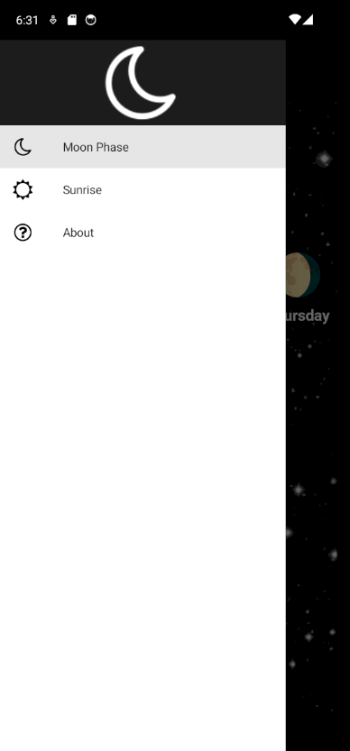
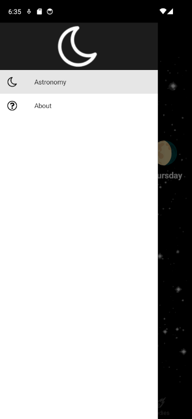
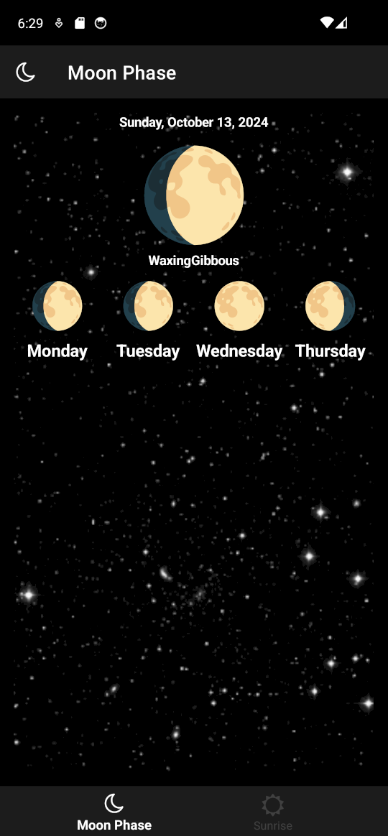
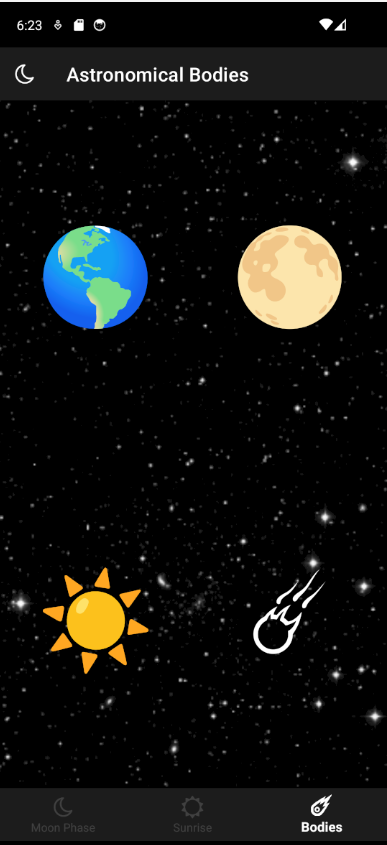
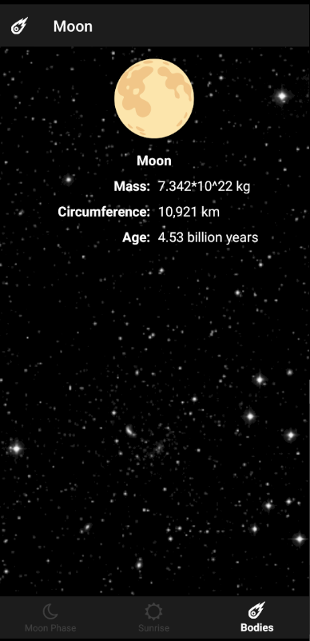

# Labo-ShellNavigation

Clone en open de repository in Visual Studio 2022

## Deel 1 
Deze oefening bevat een MAUI app die bestaat uit een aantal pagina’s die informatie tonen over hemellichamen, de standen van de maan, de tijden van zonsopgang en zonsondergang.

De applicatie bestaat momenteel uit allemaal aparte pagina’s, namelijk:
* AboutPage: toont About info van de applicatie
* MoonPhasePage: toont specifieke informatie  over de stand van de maan gezien vanaf de aarde
* SunrisePage: toon de tijden van zonsopgang en zonsondergang voor locaties op de aarde. De gegevens worden opgehaald via de Sunrise Sunset webservice (https://sunrise-sunset.org/api)
*(EXTRA: je kan in de SunriseService zien hoe een HTTP call wordt gemaakt)*

Implementeer een logische navigatiestructuur m.b.v. de Flyout navigatie. Voorzie ook een Header en icoontjes bij de Flyout Items. 
Icoontjes zijn beschikbaar in de map `\Resources\Images`. Het hamburgermenu moet ook vervangen worden door een ander icoontje.

Voorbeeld van een mogelijke Flyout navigatiestructuur:

 

## Deel 2

Vorm de ‘Moon Phase’ en ‘Sunrise’ Flyout items om naar een Tab navigatie die opgeroepen kan worden via een nieuw Flyout Item ‘Astronomy’

## Deel 3
De astronomische app uit opdracht 1 en 2 moet nu uitgebreid worden met een extra pagina waarbij de gebruiker diverse hemellichamen kan selecteren om detailinformatie van het geselecteerde hemellichaam te zien. 

In de startrepo bevinden zich nog twee extra pagina’s t.o.v. de app uit opdracht 1 en 2, namelijk:
* AstronomicalBodiesPage: deze pagina bevat vier knoppen waar de gebruiker op kan klikken om detailinformatie van het hemellichaam, afgebeeld op de knop, te kunnen raadplegen
* AstronomicalBodyPage: de detailpagina die de informatie van de diverse hemellichamen omvat

Voeg de ‘AstronomicalBodiesPage’ toe aan de tab navigatie nadat geklikt wordt op het ‘Astronomy’ flyout item
Implementeer de logica achter de knoppen van de hemellichamen en toon de juiste informatie op de detailpagina van het geselecteerd hemellichaam.

Screenshots:

## Extra: 
* Zoek uit hoe je het flyout menu kan openen door op een Button op een pagina te klikken.
* Verander de *backdrop* van het Flyoutmenu en bestudeer het effect.
* Voeg een knop toe op de about page om naar de AstronomicalBodiesPage te navigeren (**niet stacked!**).